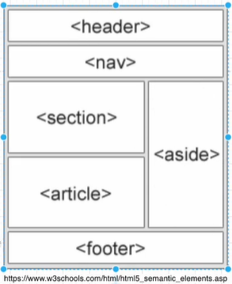

# 개념 정리
## HTML
### 블록 요소
블록 요소는 말 그대로 블록처럼 만들어진다
### 인라인 요소
블록 요소를 포함할 수 없다
한 줄 안에 들어가서 인라인이다
너비와 높이를 가질 수 없다
블록 요소로 만들고 싶다면 display 속성을 바꿔주면 된다.
### semantic 요소
이름에서 내용을 명확하게 정의한다

의미에 맞게 요소를 사용해주면 브라우저도, 개발자도 내용을 빠르게 파악할 수 있다
strong vs b
- 강조를 하고 싶다면 stong
- 그냥 볼드체라면 b
## CSS
### 표현 방법
인라인 스타일, 내부 스타일, 외부 스타일 순서로 우선 적용된다. 
### 수치 값 표현 방법
픽셀: 고정된 절댓값
퍼센트: 상대적 값
em, rem: 